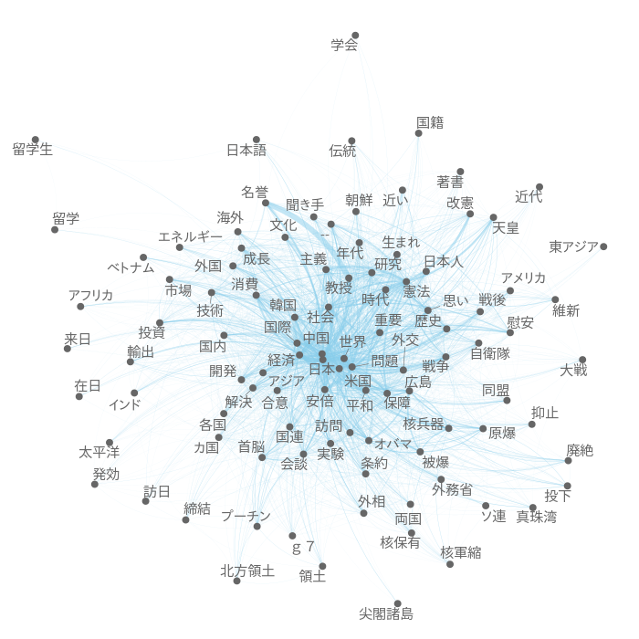

より高度な分析
==============

**dfm**は、ほかのRのパッケージと互換性があるため、**quanteda**をテキストデータの前処理に用いて、さまざまな統計分析を行うことができる。

準備
----

``` r
require(quanteda) # パッケージの読み込み
```

``` r
load('data/data_corpus_asahi_2016.RData')

# 文書行列を作成
toks <- tokens(data_corpus_asahi_2016, remove_punct = TRUE)
mx <- dfm(toks)
mx <- dfm_select(mx, min_nchar = 2) # 一文字語を削除
mx <- dfm_remove(mx, '^[ぁ-ん]+$', valuetype = 'regex') # ひらがなを削除
mx <- dfm_trim(mx, min_count = 5) # 低頻度語を削除
nfeature(mx)
```

    ## [1] 27476

分析
----

### 共起ネットワーク分析

`fcm`によって文書内での語の共起関係についての行列を作成し、共起ネットワーク分析(意味ネットワーク分析)を行える。ネットワークの視覚化には**igraph**などの専門パッケージを利用する。

``` r
require(igraph)
```

``` r
mx_top <- mx[,names(topfeatures(mx, 10))] # 最も頻度が高い10語を選択
mx_col <- fcm(mx_top, tri = FALSE) # 共起行列を作成
mx_nor <- dfm_weight(mx_col, 'relFreq') # 共起頻度を標準化
head(mx_nor)
```

    ## Feature co-occurrence matrix of: 10 by 10 features.
    ## 10 x 10 sparse Matrix of class "fcm"
    ##         features
    ## features       日本       政府       政治       選挙       問題       経済
    ##     日本 0.21310242 0.13261093 0.08756579 0.06061643 0.11230086 0.12682384
    ##     政府 0.25380111 0.13623273 0.05334525 0.04022220 0.12045504 0.10624693
    ##     政治 0.11309025 0.03599749 0.13826593 0.20750251 0.08983947 0.07289297
    ##     選挙 0.07059273 0.02447491 0.18711226 0.19248146 0.05910272 0.05929374
    ##     問題 0.19639327 0.11006629 0.12165221 0.08875267 0.09318625 0.09647870
    ##     経済 0.20604200 0.09018972 0.09169587 0.08271687 0.08962781 0.14000290
    ##     説明 0.16206897 0.12828209 0.13098255 0.12199834 0.10351059 0.07859369
    ##     投票 0.05117761 0.01852845 0.16642150 0.31181328 0.04911712 0.04002549
    ##     社会 0.17655909 0.07151210 0.14110609 0.10516108 0.10612370 0.12240983
    ##     首相 0.17673516 0.11782344 0.07544623 0.09087227 0.09212284 0.13833703
    ##         features
    ## features       説明       投票       社会       首相
    ##     日本 0.05563875 0.03436239 0.08828962 0.08868897
    ##     政府 0.08428646 0.02380985 0.06844052 0.11315991
    ##     政治 0.05807399 0.14431233 0.09112888 0.04889618
    ##     選挙 0.04877542 0.24381898 0.06124127 0.05310650
    ##     問題 0.06214496 0.05767396 0.09280588 0.08084581
    ##     経済 0.04383490 0.04366112 0.09944678 0.11278204
    ##     説明 0.04910677 0.08255089 0.06457208 0.07833403
    ##     投票 0.04220812 0.23501766 0.05666339 0.02902738
    ##     社会 0.04433051 0.07608277 0.10966044 0.04705438
    ##     首相 0.05358970 0.03883868 0.04688921 0.16934544
    ## (showing first 6 documents and first 6 features)
    ##         features
    ## features       日本       政府       政治       選挙       問題       経済
    ##     日本 0.21310242 0.13261093 0.08756579 0.06061643 0.11230086 0.12682384
    ##     政府 0.25380111 0.13623273 0.05334525 0.04022220 0.12045504 0.10624693
    ##     政治 0.11309025 0.03599749 0.13826593 0.20750251 0.08983947 0.07289297
    ##     選挙 0.07059273 0.02447491 0.18711226 0.19248146 0.05910272 0.05929374
    ##     問題 0.19639327 0.11006629 0.12165221 0.08875267 0.09318625 0.09647870
    ##     経済 0.20604200 0.09018972 0.09169587 0.08271687 0.08962781 0.14000290

``` r
gr <- graph_from_adjacency_matrix(mx_nor, weighted = TRUE, diag = FALSE) # グラフオブジェクトを作成
igraph.options(plot.layout=layout.graphopt)
plot(gr, edge.width = E(gr)$weight * 20,  edge.arrow.size = 0.5, vertex.size = 30)
```


