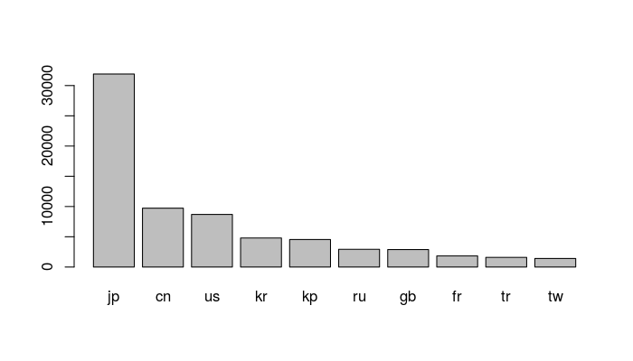

tokens
======

**tokens**は語や記号などを分割された状態で効率的に処理する**quanteda**の独自オブジェクト。**tokens**の作成・操作を行う関数は`tokens_*`と命名されている。

作成
----

`tokens()`は**[ICU](http://site.icu-project.org)**に内蔵された所書に基づき、日本語(および中国語)のテキストのトークン化では形態素解析を必要としない。テキストがあらかじめ半角スペースで分かち書きされている場合は、`what = "fastestword"`とする。

``` r
require(quanteda) # パッケージの読み込み
```

``` r
# 分かち書きされている場合
load('data/data_corpus_asahi_2016_seg.RData') # Mecabで分かち書き済み
toks <- tokens(data_corpus_asahi_2016_seg, what = "fastestword", remove_punct = FALSE)

# 分かち書きされていない場合
load('data/data_corpus_asahi_2016.RData') 
toks <- tokens(data_corpus_asahi_2016, remove_punct = FALSE)
```

操作
----

**tokens**は語の位置を保持するため`padding=TRUE`とすると、一部の語を削除した後も、語間の距離を維持することができる。

``` r
# 文字以外を削除
toks <- tokens_select(toks, '^[０-９ぁ-んァ-ヶー一-龠]+$', valuetype = 'regex', padding = TRUE)
# ひらがなを削除
toks <- tokens_remove(toks, '^[ぁ-ん]+$', valuetype = 'regex', padding = TRUE)

# KWICで用例を確認
head(kwic(toks, "トランプ"), 20)
```

    ##                                                      
    ##   [text592038, 357]          放言 続ける | トランプ |
    ##   [text592039, 420]       党 トップ 走る | トランプ |
    ##   [text592039, 490]                 右翼 | トランプ |
    ##   [text592094, 342]     実業 家 ドナルド | トランプ |
    ##   [text592094, 438]          逆に 上がる | トランプ |
    ##   [text592094, 481]              影響 大 | トランプ |
    ##    [text592329, 53]            不動産 王 | トランプ |
    ##   [text592329, 106]         不信 感 強い | トランプ |
    ##   [text592329, 136]                      | トランプ |
    ##   [text592329, 224]                 過ぎ | トランプ |
    ##   [text592329, 255]                   叫 | トランプ |
    ##   [text592329, 296]            大 隔たる | トランプ |
    ##  [text592363, 1059]         候補 座 争う | トランプ |
    ##   [text592402, 578]   首位 走る ドナルド | トランプ |
    ##    [text592457, 50] 人気 集める ドナルド | トランプ |
    ##   [text592457, 105]         訴え 国際 面 | トランプ |
    ##   [text592457, 438]            爆撃 主張 | トランプ |
    ##   [text592469, 342]       党 大統領 候補 | トランプ |
    ##   [text592469, 417]              強 批判 | トランプ |
    ##    [text592470, 61]   首位 走る ドナルド | トランプ |
    ##                           
    ##  氏 人気 衰え             
    ##  氏 メキシコ 移民         
    ##  氏 敵                    
    ##  氏 支持 率               
    ##  氏 当選 可能性           
    ##  氏 に関する 話題 大統領  
    ##  氏 優位 立               
    ##  氏 心理                  
    ##  人気                     
    ##  人気 衰え 見             
    ##  氏 有力                  
    ##  流 ポピュリズム 大衆 迎合
    ##  氏 イスラム教 徒         
    ##  氏 イスラム教 徒         
    ##  氏 排外 主義 的          
    ##  氏 批判 随所             
    ##  氏 イスラム教 徒         
    ##  氏 イスラム教 徒         
    ##  氏 排外 主義             
    ##  氏 暗 批判

``` r
# KWICをより見やすく別のウィンドウで表示
View(head(kwic(toks, "トランプ"), 100))
```

``` r
# Nグラムの生成
toks_ngram <- tokens_ngrams(toks, n = 2)
head(toks_ngram[[1]], 20)
```

    ##  [1] "衆_院"     "院_議員"   "残り_３"   "３_年"     "年_近く"  
    ##  [6] "安倍_晋"   "晋_三"     "三_首相"   "衆_参"     "参_同日"  
    ## [11] "同日_選"   "衆_院"     "院_解散"   "憲法_改正" "含む_今夏"
    ## [16] "今夏_以降" "政権_運営" "同日_選"   "続く_三つ" "判断_材料"

分析
----

### 辞書分析

``` r
# 地理的辞書の読み込み (Watanabe 2017)
dict <- dictionary(file = 'extra/watanabe_country.yml')
head(dict['ASIA'])
```

    ## Dictionary object with 1 primary key entry and 3 nested levels.
    ## - ASIA:
    ##   - CENTER:
    ##     - KZ:
    ##       - カザフスタン*, カザフ*, アスタナ
    ##     - KG:
    ##       - キルギスタン*, キルギス*, ビシュケク
    ##     - TJ:
    ##       - タジキスタン*, タジック*, ドゥシャンベ
    ##     - TM:
    ##       - トルクメニスタン*, トルクメン*, アシャバード
    ##     - UZ:
    ##       - ウズベキスタン*, ウズベク*, タシケント
    ##   - EAST:
    ##     - CN:
    ##       - 中華人民共和国*, 中国*, 北京, 上海
    ##     - TW:
    ##       - 中華民国*, 台湾*, 台北
    ##     - HK:
    ##       - 香港*
    ##     - MO:
    ##       - マカオ*
    ##     - KP:
    ##       - 朝鮮民主主義人民共和国*, 北朝鮮*, 平壌
    ##     - JP:
    ##       - 日本*, 東京
    ##     - MN:
    ##       - モンゴル*, ウランバートル
    ##     - KR:
    ##       - 大韓民国*, 韓国, ソウル
    ##   - SOUTH:
    ##     - AF:
    ##       - アフガニスタン*, アフガン, カブール
    ##     - BD:
    ##       - バングラデシュ*, ダッカ, ダッカ
    ##     - BT:
    ##       - ブータン*, ティンプー
    ##     - IN:
    ##       - インド*, ムンバイ, ニューデリー
    ##     - IR:
    ##       - イラン*, テヘラン
    ##     - MV:
    ##       - モルディブ*
    ##     - NP:
    ##       - ネパール*, カトマンズ
    ##     - PK:
    ##       - パキスタン*, イスラマバード
    ##     - LK:
    ##       - スリランカ*, コロンボ
    ##   - SOUTH-EAST:
    ##     - BN:
    ##       - ブルネイ*
    ##     - KH:
    ##       - カンボジア*, プノンペン
    ##     - ID:
    ##       - インドネシア*, ジャカルタ
    ##     - LA:
    ##       - ラオス*, ビエンチャン
    ##     - MY:
    ##       - マレーシア*, クアラルンプール, プトラジャヤ
    ##     - MM:
    ##       - ミャンマー*, ビルマ*, ヤンゴン, ナイピドー
    ##     - PH:
    ##       - フィリピン*, マニラ
    ##     - SG:
    ##       - シンガポール*
    ##     - TH:
    ##       - タイ*, バンコク
    ##     - TL:
    ##       - 東ティモール*, ディリ
    ##     - VN:
    ##       - ベトナム*, ハノイ, ホーチミン市
    ##   - WEST:
    ##     - AM:
    ##       - アルメニア*, イェレヴァン
    ##     - AZ:
    ##       - アゼルバイジャン*, アゼリ*, バクー
    ##     - BH:
    ##       - バーレーン*, マナマ
    ##     - CY:
    ##       - キプロス*, ニコシア
    ##     - GE:
    ##       - グルジア*, トビリシ
    ##     - IQ:
    ##       - イラク*, バグダッド
    ##     - IL:
    ##       - イスラエル*, エルサレム
    ##     - JO:
    ##       - ヨルダン*, アンマン
    ##     - KW:
    ##       - クウェート*, クウェートシティ
    ##     - LB:
    ##       - レバノン*, ベイルート
    ##     - PS:
    ##       - パレスチナ*, ガザ市, ガザ, ウェストバンク
    ##     - OM:
    ##       - オマーン*, マスカット
    ##     - QA:
    ##       - カタール*, ドーハ
    ##     - SA:
    ##       - サウジアラビア*, リヤド
    ##     - SY:
    ##       - シリア*, ダマスカス
    ##     - TR:
    ##       - トルコ*, アンカラ, イスタンブール
    ##     - AE:
    ##       - アラブ首長国連邦*, ドバイ, アブダビ
    ##     - YE:
    ##       - イエメン*, サナア

``` r
# 国コードでtokensを作成
toks_country <- tokens_lookup(toks, dict, levels = 3) 
head(toks_country)
```

    ## tokens from 6 documents.
    ## text592027 :
    ## [1] "TH" "TH" "JP"
    ## 
    ## text592028 :
    ##  [1] "KR" "KR" "KR" "JP" "KR" "KR" "KR" "JP" "KR" "KR"
    ## 
    ## text592029 :
    ##  [1] "HK" "JP" "JP" "HK" "JP" "JP" "JP" "JP" "JP" "JP" "JP" "JP" "JP" "JP"
    ## [15] "JP" "JP" "JP"
    ## 
    ## text592030 :
    ##  [1] "US" "US" "JP" "CN" "CN" "US" "US" "CN" "CN" "CN" "US" "JP" "CN" "CN"
    ## [15] "US" "CN" "CN" "JP" "VN" "US" "US" "US" "QA" "US" "US" "US" "CN" "US"
    ## 
    ## text592031 :
    ## [1] "CN" "CN" "CN"
    ## 
    ## text592032 :
    ##  [1] "KR" "KR" "KR" "JP" "KR" "KR" "KR" "KR" "KR" "JP" "JP" "KR"

``` r
# 集計
mx_country <- dfm(toks_country)
county_top <- topfeatures(mx_country)
```

``` r
barplot(county_top)
```



共起語分析
----------

連続的共起語を分析する際は、どのような種類の語を連続を抽出するのかを考慮し、句読点などによる語の間の距離が位置されている必要がある。このために、上記の例では、`tokens()`において`remove_punct = FALSE`とし、`tokens_remove()`では、`padding = TRUE`としてある。

``` r
# 連続的共起語の抽出
seqs <- sequences(toks, '^[０-９ァ-ヶー一-龠]+$', valuetype = 'regex', 
                  nested = FALSE, min_count = 10, ordered = FALSE)
head(seqs, 20)
```

    ##          collocation   lambda        sigma count         z p
    ## 135852   トランプ 氏 54.66442 0.0004745007  2763 115204.09 0
    ## 162855 クリントン 氏 51.11356 0.0008679320   857  58891.21 0
    ## 4872       オバマ 氏 51.09697 0.0008727678   855  58545.90 0
    ## 26024          １ ８ 51.33352 0.0008994036  1163  57075.07 0
    ## 23793          １ ０ 50.32888 0.0009273889   734  54269.45 0
    ## 235487         ２ ０ 50.53242 0.0009603246   805  52620.14 0
    ## 110858       参院 選 53.85558 0.0010287936  4103  52348.28 0
    ## 221830       政治 的 50.74852 0.0009786241   825  51857.01 0
    ## 261416       具体 的 51.33086 0.0010177228  1154  50436.98 0
    ## 236206         ２ 人 51.29702 0.0010676035  1268  48048.75 0
    ## 24698          １ 人 50.72662 0.0011299331  1062  44893.47 0
    ## 194201     日本 政府 51.43838 0.0011735314  1404  43832.12 0
    ## 189803       積極 的 50.46016 0.0011801788   866  42756.37 0
    ## 126735       舛添 氏 49.39619 0.0011610316   486  42545.08 0
    ## 140623         自 民 52.29302 0.0012338220  2248  42382.96 0
    ## 189685         朴 氏 49.32566 0.0011750949   475  41975.89 0
    ## 38984        甘利 氏 49.18957 0.0012004475   453  40976.03 0
    ## 60866        関係 者 50.43648 0.0013032699   939  38699.95 0
    ## 91520        小池 氏 48.75972 0.0012874454   392  37873.24 0
    ## 250219         ３ 人 50.03550 0.0013497256   836  37070.87 0

``` r
# 共起語の結合
toks_comp <- tokens_compound(toks, seqs[seqs$p < 0.01,], valuetype = 'fixed', 
                             concatenator = '', join = TRUE)

head(kwic(toks, "トランプ*", window = 10)) # 結合前
```

    ##                                                                   
    ##  [text592038, 357]              入国 禁止 放言 続ける | トランプ |
    ##  [text592039, 420]      大統領 選 共和 党 トップ 走る | トランプ |
    ##  [text592039, 490]                        過激派 右翼 | トランプ |
    ##  [text592094, 342]  政治 経験 乏しい 実業 家 ドナルド | トランプ |
    ##  [text592094, 438]            支持 下がる 逆に 上がる | トランプ |
    ##  [text592094, 481]                            影響 大 | トランプ |
    ##                                   
    ##  氏 人気 衰え 分断 分断           
    ##  氏 メキシコ 移民 イスラム教 徒 敵
    ##  氏 敵 戦                         
    ##  氏 支持 率 首位 走る             
    ##  氏 当選 可能性 高い              
    ##  氏 に関する 話題 大統領 選 乗 取

``` r
head(kwic(toks_comp, "トランプ*", , window = 10)) # 結合後
```

    ##                                                                         
    ##  [text592038, 327]      イスラム教徒 入国禁止 放言 続ける | トランプ氏 |
    ##  [text592039, 379] 今年注目 米大統領選 共和党 トップ 走る | トランプ氏 |
    ##  [text592039, 445]                            過激派 右翼 | トランプ氏 |
    ##  [text592094, 295]     縫 政治経験 乏しい 実業家 ドナルド | トランプ氏 |
    ##  [text592094, 386]                支持 下がる 逆に 上がる | トランプ氏 |
    ##  [text592094, 427]                                影響 大 | トランプ氏 |
    ##                               
    ##   人気 衰え 分断 分断         
    ##   メキシコ移民 イスラム教徒 敵
    ##   敵 戦                       
    ##   支持率 首位 走る 手法       
    ##   当選 可能性 高い            
    ##  に関する 話題 大統領選 乗 取
